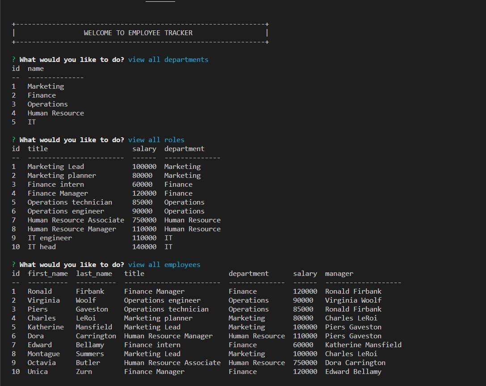
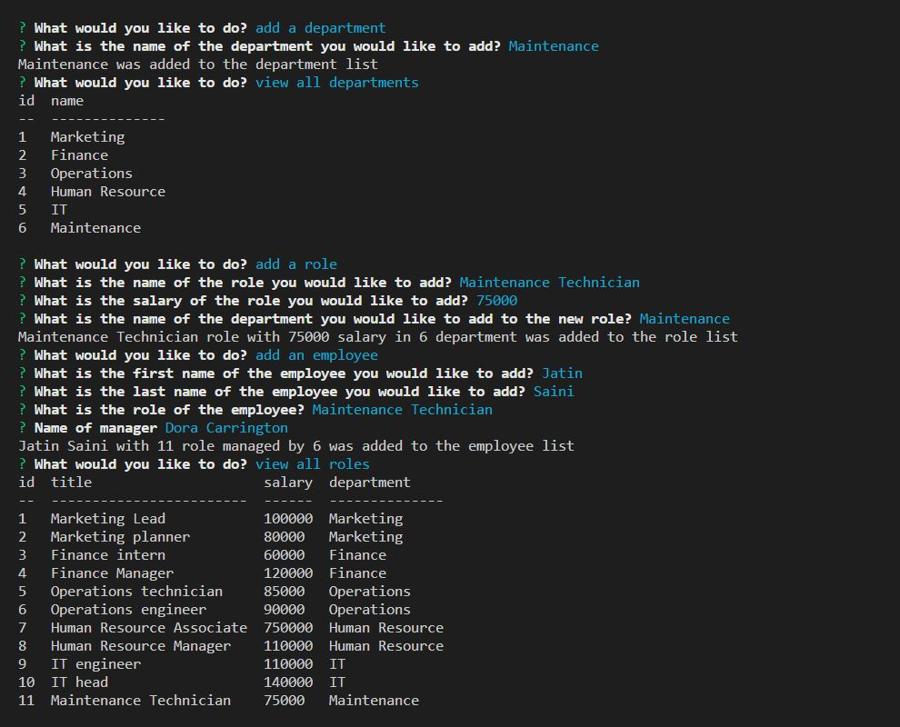
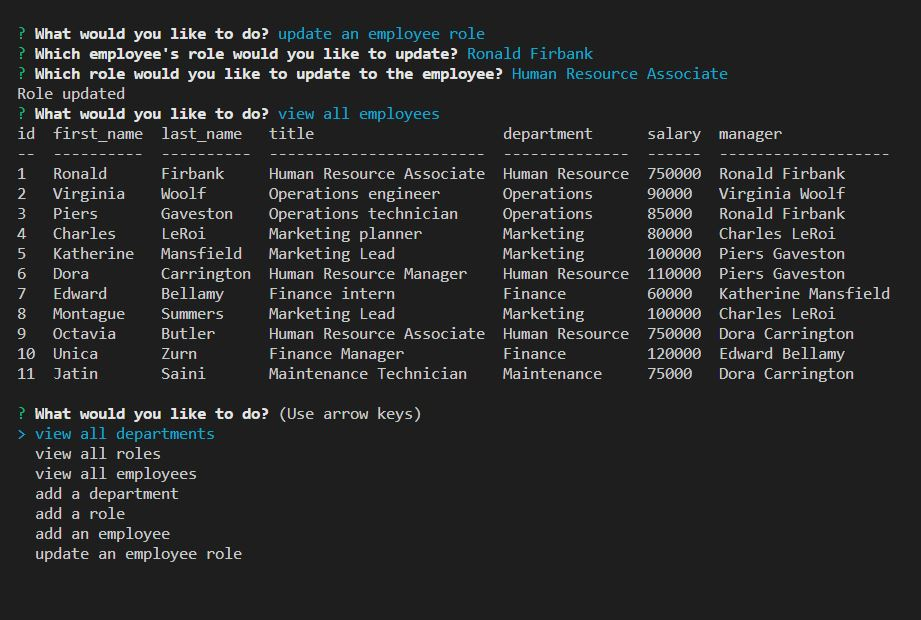

# Employee-Tracker

## User Story

AS A business owner
I WANT to be able to view and manage the departments, roles, and employees in my company
SO THAT I can organize and plan my business

## Description

The application provide management for a company employee database.
The command line prompted application has functions like - "view all departments","view all roles",
"view all employees","add a department","add a role","add an employee","update an employee role"
        
Following is the link to the Walkthrough video : https://drive.google.com/file/d/1i5rigtJ8ftt6iX8O3rEkNtQqufV2KIeq/view

## Usage Information
The user can do CRUD operations in the database.

## Screencapture

## Built using
* Javascript
* SQL
* Node.js
* Inquirer

## Contribution

Made by Jatin